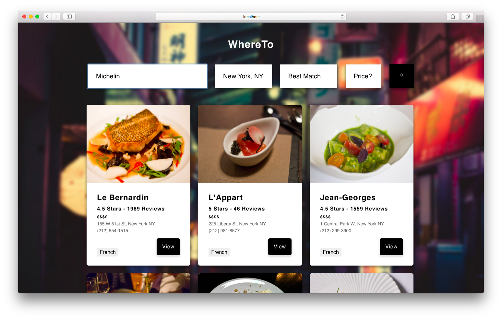

<p align="center">
  
</p>
<h3 style="text-align: center;">
  WhereTo
</h3>
<p style="color: #aaa; text-align: center;">Yelp Search Client</p>

<p align="center">

</p>

<p align="center">
  
    </br>
    WhereTo is a beautiful Yelp search client to help you find great places.
</p>

## Getting Started with WhereTo
These instructions will get you a copy of the project up and running on your local machine for development and testing purposes.

### Prerequisites
Things you need to install beforehand:
* **npm** - Javascript package manager

### Installing

Open terminal and run the following lines of code to clone and run this project.

 ```shell
 $ git clone https://github.com/SeeYouSpaceCowboy/yelp-search-reactjs.git
 $ cd yelp-search-reactjs
 $ npm i
 $ npm start
 ```
Make sure to also clone and have the back-end of this project [here](https://github.com/SeeYouSpaceCowboy/yelp-search-nodejs.git) running before running the front-end.

## Built With
* [Create React App](https://github.com/facebookincubator/create-react-app) - Create React apps with no build configuration.

## Contributors
WhereTo was built by [Mohammed Chisti](http://mohammedchisti.com).
